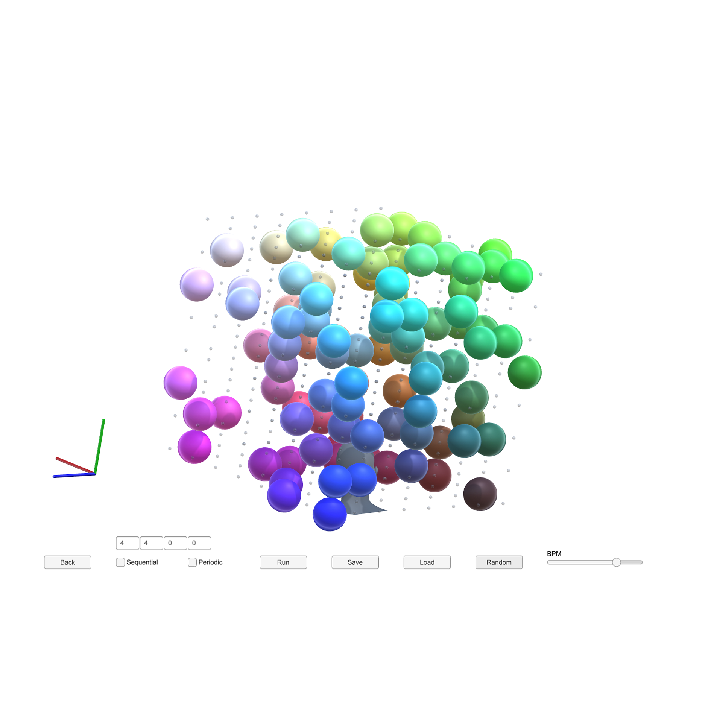
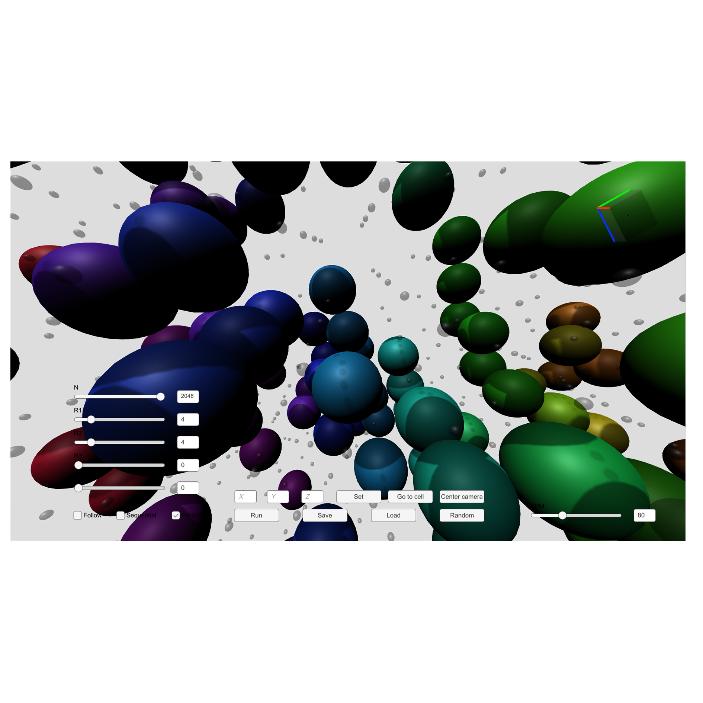

# 3D Conway's Game of Life

3D Conway's Game of Life with Auralization powered by Unity.

## Description
 
For the Desktop version, we've implemented both original and sandpile cellular automata in three-dimensional grid with sounds associated with each cell (using audio spatialization to accurately represent the actual localization of cells). Adding spatialization to sonification can be considered a kind of auralization. For the VR version, to improve the immersibility, we've implemented Virtual-Perspective and First-Person-Perspective of original cellular automaton. 

You can explore and generate new patterns from random initial conditions and the rules defined by users. In addition to sandpile one, you can set initial position of the pile.




[](http://www.youtube.com/watch?v=kSOa_Kmai9E "demo")
 
## Features
 
- Supports Desktop / VR (HTC-Vive)
- Supports Original / Sandpile Cellular Automata
- Supports Periodic / Sequential options
- Can define the rules as you want
- Can save / load patterns with your own rules (csv files)
- Runs on MacOS 10.14+ / Win (Linux is coming soon)
 
For more information, contact me.
 
## Requirements

The Desktop ver. was tested with a following environment.
- MacOS 10.14+
- CPU: Intel Core i5 2.4 GHz Quad-Core
- RAM: LPDDR3 16GB 2133 MHz
- Graphics: Intel Iris Plus Graphics 655

The VR ver. was tested with a following environment.
- editing...

## Usage
 
1. Choose models you want to play
2. Set rules (the rule will be initialized by [4,4,0,0])
3. Run
 
## Installation
 
```
$ git clone https://github.com/YKariyado/LG.git
```
then, open GoL.app

## Presets
- Rocket


- Hydropump


- Dictyostelium


We prepared oscillators: Rocket, Blinkers and the like.
 
## Author
 
[@hrmtcrb]
mail to: s1250192@u-aizu.ac.jp

[@arevaloarboled]
mail to: m5231113@u-aizu.ac.jp

 
## License
 
[MIT](LICENSE)</blockquote>
