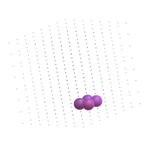

# Auralization of Three-Dimensional Cellular Automata
Auralization of Three-Dimensional Cellular Automata powered by Unity.

## Description
For desktop version (**V1**), we've implemented both original and sandpile cellular automata in three-dimensional grid with sounds associated with each cell (using audio spatialization to accurately represent the actual localization of cells). Adding spatialization to sonification can be considered a kind of auralization.
For VR version (**V2**), to improve the immersibility, we've implemented First-Person-Perspective of original cellular automaton. 

You can explore and generate new patterns from random initial conditions and the rules defined by users. I hope you find your favorites!

<!--


-->

[Cellular Automaton Desktop ver.](http://www.youtube.com/watch?v=kSOa_Kmai9E "Desktop")
[Cellular Automaton VR ver.](https://youtu.be/KgRhsvUY_0c "VR")
 
## Features
### Desktop
- Supports Original / Sandpile cellular automata
- Supports Periodic / Sequential options
- Can define the rules as you want
- Can save / load patterns with your own rules (csv files)

### VR
- Supports Periodic / Sequential options
- Can define the rules as you want
- Can save / load patterns with your own rules (csv files)

V1 runs on MacOS 10.14+, V2 runs on Windows only.
 
For more information, contact [us](#Author).

## Requirements
V1 was tested by the following environments.
- Unity 2020.1.6f1
- MacOS 10.14+
- CPU: Intel Core i5 2.4 GHz Quad-Core
- RAM: LPDDR3 16GB 2133 MHz
- Graphics: Intel Iris Plus Graphics 655

V2 tested by the following environments.
- Unity 2020.1.9f1
- Windows 10+ 
- CPU: Inter(R) Core(TM) i7-7700 3.60 GHz
- RAM: 8.00 GB
- Graphics: Nvidia GeForce GTX 1080 Ti 11 GB

## Usage
### V1
1. Run GoL.app
2. Choose models you want to play
3. Set rules (the rule will be initialized by [4,4,0,0])
4. Push **Random** or **Load** to set cells
5. Push **Run**
6. Push **Save**, and name it to store as a preset

### V2
1. Run GoL.exe
2. Set rules (the rule will be initialized by [4,4,0,0])
3. Push **Initialize** or **Load** to set cells 
4. Push **Run**
5. Push **Save**, and name it to store as a preset
 
## Installation
```
$ git clone https://github.com/YKariyado/LG.git
```

## Presets
Introduction of some presets we've found so far.
- Rocket


- Hydropump


- Dictyostelium


some more oscillators...
 
## Author
[@hrmtcrb]
mail to: s1250192@u-aizu.ac.jp

[@arevaloarboled]
mail to: m5231113@u-aizu.ac.jp

 
## License
[MIT](LICENSE)</blockquote>
